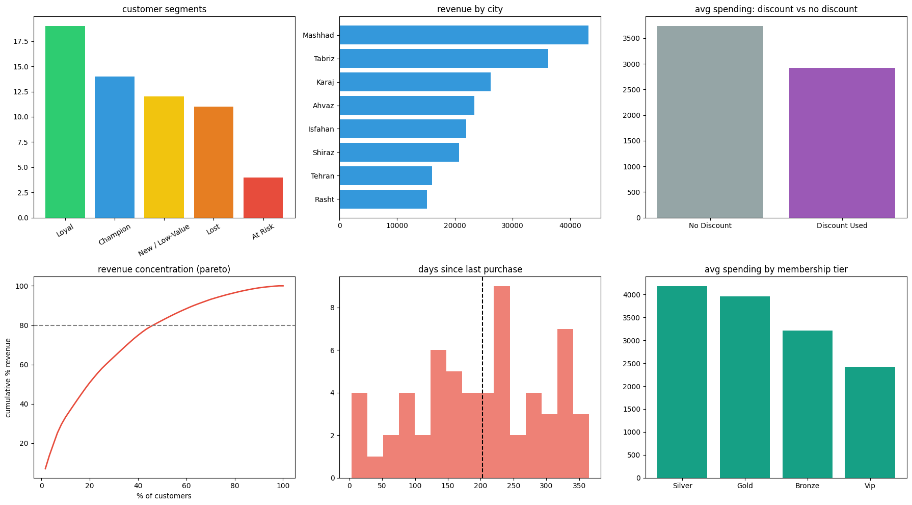

# Project 02 – The First Day as a Junior Data Analyst

## Overview

This project analyzes customer behavior for an e-commerce company using the cleaned dataset from Project 01. The goal is to help the CEO make better business decisions through data-driven analysis and answer key business questions.

## Input

`cleaned_dataset.xlsx` — the cleaned dataset produced in Project 01.

## Tools

- Python
- pandas
- numpy
- matplotlib

---

## 1. Business Overview – Key KPIs

| KPI | Result |
|---|---:|
| Total customers | 60 |
| Total revenue | $202,894.15 |
| Average order value | $213.16 |
| Average purchases per customer | 17.4 |
| Average satisfaction score | 2.98 / 5 |
| Customers who used a discount | 43.3% |
| Average returned items | 4.2 |

### Key Finding

The customer base generates over **$200K in total revenue**, with customers making an average of **17.4 purchases**. However, the average satisfaction score is only **2.98/5**, suggesting that improving customer experience and retention should be considered alongside revenue growth.

---

## 2. Which City Should Be Selected for the Next Marketing Campaign?

### Recommendation: Isfahan

**Isfahan is the best candidate for the next marketing campaign.**

| City | Customers | Total Revenue | Avg. Spending | Avg. Satisfaction |
|---|---:|---:|---:|---:|
| **Isfahan** | 5 | $21,975.30 | **$4,395.10** | **4.4 / 5** |
| Mashhad | 11 | $43,197.60 | $3,927.10 | 2.9 / 5 |
| Karaj | 7 | $26,189.80 | $3,741.40 | 2.9 / 5 |
| Shiraz | 6 | $20,715.90 | $3,452.70 | 2.0 / 5 |
| Rasht | 5 | $15,168.50 | $3,033.70 | 2.6 / 5 |
| Tabriz | 12 | $36,192.50 | $3,016.00 | 3.0 / 5 |
| Ahvaz | 8 | $23,384.80 | $2,923.10 | 3.5 / 5 |
| Tehran | 6 | $16,069.70 | $2,678.30 | 2.7 / 5 |

### Business Decision

Isfahan is recommended for the next marketing campaign because it combines the **highest average spending ($4,395)** with the **highest satisfaction score (4.4/5)**. Higher spending suggests stronger customer value and purchasing potential, while higher satisfaction can encourage positive word-of-mouth and attract new customers. Although only 5 customers are currently from Isfahan, this also suggests significant room for growth and an underdeveloped market. Mashhad is better for immediate revenue due to its higher total revenue, but Isfahan appears more promising for long-term strategic growth.

---

## 3. Who Are the 10 Most Valuable Customers?

The 10 most valuable customers were selected using an **RFM score** based on:

- **Recency** – how recently the customer purchased
- **Frequency** – how often the customer purchased
- **Monetary value** – how much the customer spent

Using RFM rather than total spending alone prevents a customer with one unusually large purchase from automatically ranking above a consistently active customer.

| Customer | City | Total Spending | Purchases | Days Since Last Purchase | RFM Score |
|---|---|---:|---:|---:|---:|
| Maryam (1057) | Ahvaz | $13,532.74 | 31 | 82 | 12 |
| Mina (1044) | Shiraz | $14,354.34 | 33 | 165 | 11 |
| Sina (1004) | Mashhad | $6,121.45 | 23 | 40 | 11 |
| Amir (1040) | Tehran | $2,188.86 | 34 | 126 | 11 |
| Neda (1033) | Tabriz | $5,521.20 | 24 | 112 | 11 |
| Reza (1014) | Tabriz | $3,353.89 | 31 | 97 | 11 |
| Arash (1012) | Mashhad | $11,731.50 | 27 | 224 | 10 |
| Parsa (1017) | Ahvaz | $3,239.40 | 30 | 135 | 10 |
| Arash (1047) | Tabriz | $5,080.01 | 23 | 180 | 10 |
| Maryam (1045) | Rasht | $3,871.92 | 24 | 132 | 10 |

These 10 customers account for **34.0% of total company revenue**.

### Business Decision

These customers should be prioritized for a loyalty program through personalized offers, loyalty benefits, early access, or other retention activities.

---

## 4. Which Customers Are at Risk of Leaving?

The analysis identifies **4 At-Risk customers**. These customers previously showed relatively strong purchasing behavior but have not purchased recently.

| Customer | City | Purchases | Total Spending | Days Since Last Purchase |
|---|---|---:|---:|---:|
| Ali (1049) | Mashhad | 23 | $2,140.38 | **357** |
| Maryam (1034) | Tabriz | 29 | $2,117.00 | **280** |
| Ali (1018) | Shiraz | 18 | $1,974.60 | **257** |
| Zahra (1031) | Tehran | 18 | $1,915.74 | **261** |

These four customers have generated approximately **$8,147** in historical spending and have been inactive for **257–357 days**.

There are also **11 customers classified as Lost**, but the At-Risk group is a more immediate retention opportunity because these customers previously demonstrated stronger purchasing behavior.

### Business Decision

Launch a targeted **re-engagement campaign** for the 4 At-Risk customers before allocating significant resources to the broader Lost segment.

---

## 5. Do Customers Who Used Discounts Behave Differently from Those Who Did Not?

### Yes, but mainly in spending and satisfaction — not purchase frequency.

| Metric | No Discount | Discount Used |
|---|---:|---:|
| Customers | 34 | 26 |
| Avg. total spending | **$3,736.74** | $2,917.11 |
| Avg. purchase count | 17.29 | **17.50** |
| Avg. order value | **$220.70** | $203.29 |
| Avg. satisfaction | 2.76 | **3.27** |
| Avg. returned items | 4.26 | 4.08 |

### Findings

Discount users made almost exactly the same number of purchases as non-users:

**17.50 vs. 17.29 purchases per customer.**

Therefore, the data does **not** show that discounts increase purchase frequency.

However, discount users spent less:

- **$819.63 less** in average total spending
- **$17.41 less** in average order value

At the same time, discount users reported higher satisfaction:

- **3.27 vs. 2.76**

The average number of returned items was also very similar:

- **4.08 vs. 4.26**

The correlation between discount usage and satisfaction is only **0.18**, so this relationship should be interpreted as an association rather than evidence that discounts cause higher satisfaction.

### Business Decision

Discounts should not be assumed to be a direct revenue-growth strategy. Instead of applying them broadly, the company should test **targeted discounts**. In particular, they could be tested with At-Risk customers, whose average satisfaction is only 2.0/5. The company should measure whether targeted discounts increase their likelihood of returning without unnecessarily reducing revenue.
---

## 6. How Can Customers Be Segmented into Meaningful Groups?

Customers were segmented using **RFM analysis** into five groups:

| Segment | Customers | Avg. Spending | Avg. Satisfaction |
|---|---:|---:|---:|
| Champion | 14 | **$7,111.34** | 3.14 |
| Loyal | 19 | $3,601.06 | 3.21 |
| At Risk | 4 | $2,036.93 | **2.00** |
| Lost | 11 | $1,121.11 | 2.36 |
| New / Low-Value | 12 | $1,202.95 | 3.33 |

### Interpretation

**Champions** are the highest-value customers, with average spending of **$7,111.34**. They should be protected and rewarded.

**Loyal customers** are the largest segment, with **19 customers**, and generate an average of **$3,601.06** each. They represent an important base for repeat revenue.

**At-Risk customers** have previously demonstrated purchasing activity but have become inactive. Their average satisfaction is also the lowest at **2.00/5**, making them a key retention priority.

**Lost customers** have relatively low average spending of **$1,121.11**, making them a lower-priority retention group compared with At-Risk customers.

**New / Low-Value customers** currently have lower spending but relatively high satisfaction (**3.33/5**), suggesting an opportunity to develop them into more valuable customers over time.

### Business Decision

Different segments should receive different strategies rather than one general marketing approach:

- Champions → loyalty and VIP programs
- Loyal → retention and upselling
- At Risk → re-engagement campaign
- Lost → low-cost reactivation tests
- New / Low-Value → engagement and conversion strategies

---

## 7. Does a Small Percentage of Customers Generate Most of the Revenue?

### No strong 80/20 Pareto pattern was found.

The **top 20% of customers (12 customers)** generate **50.8% of total revenue**.

To reach **80% of total revenue**, the company needs **28 customers**, representing **46.7% of the customer base**.

Therefore, revenue is concentrated among higher-value customers, but not enough to support a classic **80/20 relationship**.

### Business Decision

The company should protect high-value customers, but it should **not rely on a very small group of customers for most of its revenue**.

Because almost half of the customer base is needed to generate 80% of revenue, broad customer retention and development remain important.

---

## 8. CEO Dashboard

The dashboard provides a concise view of the most important business findings through charts covering:

- Customer segment distribution
- Revenue by city
- Average spending: discount vs. no discount
- Revenue concentration (Pareto analysis)
- Days since last purchase
- Average spending by membership tier

These charts allow the CEO to quickly identify high-value customers, potential churn problems, geographic opportunities, and revenue concentration.

---

## 9. Three Business Recommendations

### 1. Launch a targeted re-engagement campaign

Prioritize the **4 At-Risk customers**.

They have made an average of approximately **22 purchases** and generated an average of **$2,036.93** in spending, but have been inactive for **257–357 days**.

These customers have already demonstrated purchasing behavior, making them a stronger immediate retention target than the 11 Lost customers.

**Recommended action:** Send personalized win-back messages and test targeted incentives. Measure reactivation rate and subsequent revenue.

---

### 2. Replace broad discounts with targeted discount testing

Discount users spend less overall (**$2,917 vs. $3,737**) and have a lower average order value (**$203 vs. $221**), while purchase frequency is almost identical.

However, discount users report higher satisfaction (**3.27 vs. 2.76**).

This suggests that discounts may provide a customer-experience benefit without directly increasing revenue.

**Recommended action:** Use discounts selectively, especially for At-Risk customers, and run an A/B test to determine whether discounts actually improve retention or revenue before expanding the strategy.

---

### 3. Test Isfahan for growth while protecting Mashhad revenue

Isfahan has the highest average spending (**$4,395 per customer**) and the highest satisfaction (**4.4/5**), making it the strongest candidate for a small-scale marketing test.

However, only **5 customers** are represented in Isfahan, so this result is directional.

Mashhad generates the highest total city revenue (**$43,197.60**) from 11 customers, but its satisfaction score is only **2.9/5**.

**Recommended action:** Test the next marketing campaign in Isfahan while simultaneously investigating satisfaction and retention issues in Mashhad.

---

## 10. Limitations

- The dataset contains only **60 customers**, so city-level and segment-level findings are directional rather than statistically proven.
- The data contains customer-level totals rather than order-level records, so trends over time and product-level drivers cannot be analyzed.
- `discount_used` is binary (Yes/No), so the actual discount amount is unavailable.
- No statistical significance testing was performed.
- The dataset does not include product preferences, income, acquisition channel, or other variables that could improve customer targeting.
- The analysis identifies associations, not causal relationships.

---

## Files

- `project02_analysis.ipynb` — analysis notebook containing the Python code, charts, findings, and recommendations
- `README.md` — project documentation and business findings
- `customer_segments.csv` — customer data with RFM scores and segment labels
- Chart `.png` files — saved visualizations from the analysis

## How to Run

1. Place `cleaned_dataset.xlsx` in the same folder as `project02_analysis.ipynb`.
2. Run the notebook cells from top to bottom.
3. The notebook generates the customer segmentation CSV and chart files.
