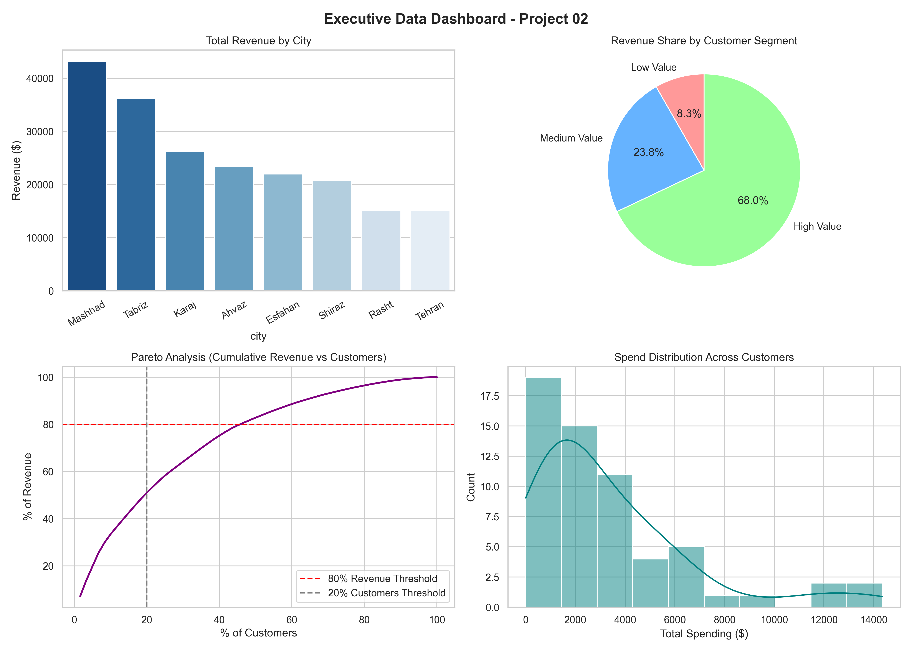

# Customer Analytics & Business Insights (Project 02)

## Overview
This repository contains a customer behavior analysis designed to help drive data-backed executive decisions. Using Python, I explored customer spending patterns, identified top-performing geographic locations, analyzed discount effectiveness, and built an executive dashboard summary.

### Key Findings & Insights
- **Top Performing Cities:** **Mashhad** and **Tabriz** generated the highest overall revenue, making them ideal targets for future marketing campaigns.
- **High-Value Customers (Pareto Principle):** The top **20% of customers generate 51% of total revenue**, highlighting the need for a targeted VIP loyalty program.
- **Discount Impact:** Customers who purchased without discount codes had a higher average order value compared to those who used discounts, suggesting that generic discounts may not be necessary to drive larger sales.

### Executive Dashboard
The analysis concludes with a 4-chart executive dashboard covering:
1. Total Revenue by City
2. Revenue Share by Customer Segment
3. Cumulative Revenue Curve (Pareto Analysis)
4. Customer Spending Distribution

### Tech Stack
- **Python**
- **Pandas** (Data manipulation & aggregation)
- **Matplotlib & Seaborn** (Data visualization & plotting)

### Project Structure
- `project02_analysis.ipynb` - Primary Jupyter Notebook with full analysis and logic.
- `cleaned_dataset_Elham-Azari.xlsx` - Cleaned dataset used for analysis.
- `dashboard_summary.png` - Exported executive visualization dashboard.

---
*Submitted by Elham Azari Anzabi*
