# Customer Analytics and Sales Growth Strategy

## 1. Introduction

The purpose of this project is to analyze customer data from an e-commerce company and transform raw customer-level information into actionable business insights.

The analysis is designed from the perspective of a Junior Data Analyst working for an online store. The management team wants to understand several important questions:

1. Which customers are the most valuable to the company?
2. Which customers are likely to stop purchasing?
3. Which cities are the best targets for marketing activities?
4. Were discounts actually useful?
5. What actions should the company take to increase sales?

The objective of this project is therefore not simply to clean the dataset, calculate statistics, or create charts. The main objective is to connect customer behavior to business decisions.

The analysis follows a complete analytical workflow:

**Data Understanding → Data Cleaning → Exploratory Data Analysis → Feature Engineering → Customer Segmentation → Risk Analysis → Discount Analysis → Geographic Analysis → Business Recommendations**

The final goal is to identify where the company is currently generating value, where it is at risk of losing revenue, and where additional investment could generate profitable growth.

---

# 2. Dataset Overview

The dataset contains information about 60 customers and 18 original variables.

The variables describe several different dimensions of customer behavior:

### Customer characteristics

* `customer_id`
* `first_name`
* `gender`
* `age`
* `city`
* `province`

### Customer relationship information

* `signup_date`
* `membership_tier`

### Purchasing behavior

* `purchase_count`
* `avg_order_value`
* `total_spending`
* `last_purchase_days`

### Transaction and technology information

* `payment_method`
* `device`
* `discount_used`

### Customer experience

* `returned_items`
* `satisfaction_score`

This structure is useful because it allows customer value to be evaluated from multiple perspectives rather than using only revenue.

For example, a customer who has spent a large amount historically but has not purchased for a long time represents a different business situation from a customer who spends less but purchases frequently and recently.

---

# 3. Initial Data Quality Assessment

Before performing any business analysis, the dataset was examined to understand its structure and quality.

The first step was inspecting the first rows using `head()`.

This allowed us to verify that the columns contained the expected information and that categorical and numerical variables appeared to be represented correctly.

The dataset contains:

* 60 observations
* 18 variables
* Numerical, categorical, and date variables

The `info()` output showed that `signup_date` was already represented as a datetime variable, while numerical variables such as `age`, `purchase_count`, `avg_order_value`, and `total_spending` were represented numerically.

This is important because incorrect data types can lead to incorrect calculations and visualizations.

---

# 4. Missing-Value Analysis

The next step was checking for missing values.

The result was:

```text
All variables: 0 missing values
```

Therefore, no missing-value imputation was necessary.

This is an important finding because replacing missing values unnecessarily can introduce artificial information into the dataset.

Since every customer has complete information for the available variables, the analysis can proceed without removing observations or imputing values.

---

# 5. Duplicate and Uniqueness Analysis

The dataset contains 60 unique customer IDs.

The `customer_id` column has 60 unique values for 60 observations, which indicates that each row represents a distinct customer.

The `Unnamed: 0` column also contains 60 unique values and appears to be an automatically generated dataframe index rather than a meaningful business variable.

Therefore, this column was not used in the analytical calculations.

The uniqueness analysis also showed that categorical variables have a reasonable number of categories:

* 2 genders
* 8 cities
* 8 provinces
* 4 membership tiers
* 3 payment methods
* 3 devices
* 5 satisfaction levels

This confirms that these variables can be used for segmentation and comparison.

---

# 6. Descriptive Statistics

Descriptive statistics were calculated to understand the overall distribution of customer behavior.

The average customer age is approximately:

**43.6 years**

The average number of purchases is:

**17.38 purchases**

The average order value is:

**213.16**

The average total customer spending is:

**3,366.43**

The average number of days since the last purchase is:

**198.6 days**

The average satisfaction score is approximately:

**2.98 out of 5**

The average number of returned items is:

**4.18**

These statistics already reveal several important characteristics.

The customer base has substantial variation in purchasing behavior. Total spending ranges from:

**0**

to:

**14,354.34**

Similarly, average order value ranges from approximately:

**27.63**

to:

**449.81**

This large variation suggests that customers cannot be treated as one homogeneous group.

Some customers generate substantial value, while others have very limited purchasing activity.

---

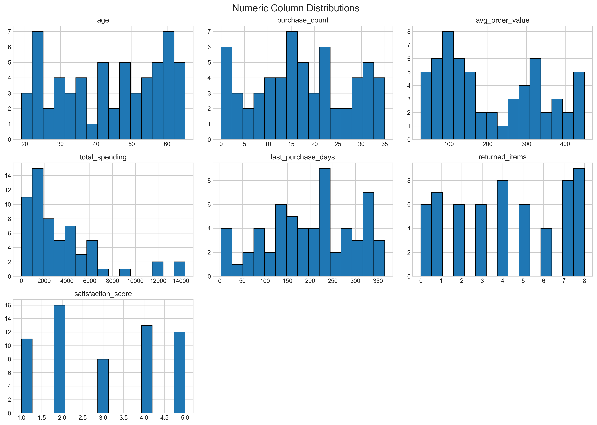

---

# 7. Why Customer Segmentation Is Necessary

A major analytical problem is that customer value cannot be measured using a single variable.

For example:

* A customer may have high total spending but be inactive.
* Another customer may have moderate spending but purchase very frequently.
* Another customer may have a high average order value but very few purchases.
* Another customer may have low spending but very high satisfaction and strong recent activity.

Therefore, the analysis combines multiple behavioral indicators.

The main dimensions considered are:

### Monetary value

How much money has the customer generated?

Measured using:

`total_spending`

### Frequency

How often does the customer purchase?

Measured using:

`purchase_count`

### Recency

How recently did the customer purchase?

Measured using:

`last_purchase_days`

### Customer experience

How satisfied is the customer?

Measured using:

`satisfaction_score`

### Return behavior

How frequently does the customer return products?

Measured using:

`returned_items`

This multidimensional approach provides a much more realistic representation of customer value.

---

# 8. Feature Engineering and Standardization

Because the variables used for segmentation have different scales, directly combining them would be problematic.

For example:

* `total_spending` can be thousands of units.
* `purchase_count` is typically between 0 and 35.
* `last_purchase_days` can reach 365.
* `satisfaction_score` ranges from 1 to 5.

If these variables were simply added together, variables with larger numerical scales would dominate the resulting score.

To avoid this problem, numerical behavioral variables were standardized using **Z-score normalization**.

The Z-score is calculated as:

[
z = \frac{x-\mu}{\sigma}
]

where:

* (x) is the customer's value
* (\mu) is the population/sample mean used for standardization
* (\sigma) is the standard deviation

This transforms variables into comparable units based on their distance from the mean.

A Z-score of:

* `0` means approximately average
* `+1` means one standard deviation above the mean
* `-1` means one standard deviation below the mean

This approach is particularly useful when constructing composite customer scores because the different variables become comparable.

Importantly, standardization does not mean that the original values are lost. The original variables remain available for business interpretation.

---

# 9. Customer Value Analysis

The first major business question was:

> **Which customers are most valuable to the company?**

The primary indicator of historical customer value is `total_spending`.

However, total spending alone is not sufficient.

For example, a customer who generated 10,000 several years ago but has not purchased since may be less valuable from a current retention perspective than a customer who has generated 7,000 and purchased recently.

Therefore, customer value was evaluated using multiple behavioral dimensions.

Customers were categorized into value groups such as:

* High Value
* Low Value

The analysis also incorporated purchase frequency and other behavioral indicators.

The results show substantial differences between customers.

Some customers have generated exceptionally high revenue.

The highest-spending customers include:

* Customer 1044 — 14,354.34
* Customer 1057 — 13,532.74
* Customer 1012 — 11,731.50
* Customer 1009 — 11,615.42
* Customer 1059 — 8,898.55
* Customer 1010 — 7,241.47

These customers deserve particular attention because losing a high-value customer can have a much larger financial impact than losing a low-value customer.

---

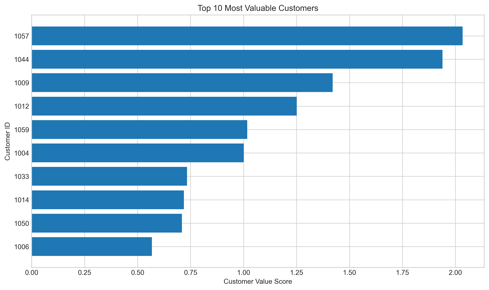

---

# 10. RFM-Based Customer Analysis

To better understand customer behavior, an RFM-style approach was also used.

RFM stands for:

* **Recency**
* **Frequency**
* **Monetary Value**

### Recency

Measured using:

`last_purchase_days`

A smaller number is better because it means the customer purchased more recently.

### Frequency

Measured using:

`purchase_count`

A higher value indicates more frequent purchasing.

### Monetary

Measured using:

`total_spending`

A higher value indicates greater historical customer value.

RFM is particularly useful because it distinguishes between customers who have historically generated value and customers who are currently active.

For example:

A customer with:

* high spending
* high frequency
* low recency

is an excellent customer.

However:

A customer with:

* high spending
* high frequency
* very high days since last purchase

is potentially a valuable customer who is now at risk.

This distinction is essential for retention decisions.

---

# 11. Identifying Customers at Risk of Churn

The second major business question was:

> **Which customers may stop purchasing?**

The analysis identified a group of customers classified as **At Risk**.

There were 17 customers in this group.

However, the most important finding is that these customers do not have equal financial importance.

Some At Risk customers have relatively low historical value, while others have generated thousands of dollars.

For example:

| Customer | Total Spending | Days Since Last Purchase |
| -------- | -------------: | -----------------------: |
| 1012     |      11,731.50 |                      224 |
| 1009     |      11,615.42 |                      232 |
| 1010     |       7,241.47 |                      276 |
| 1050     |       6,198.00 |                      205 |
| 1035     |       5,918.21 |                      365 |

Customer 1035 is particularly important because this customer has generated 5,918.21 but has not purchased for 365 days.

Customer 1012 is another high-priority case because the customer generated 11,731.50 but has been inactive for 224 days.

This demonstrates why customer risk should not be analyzed independently from customer value.

A low-value customer at risk is not financially equivalent to a high-value customer at risk.

---

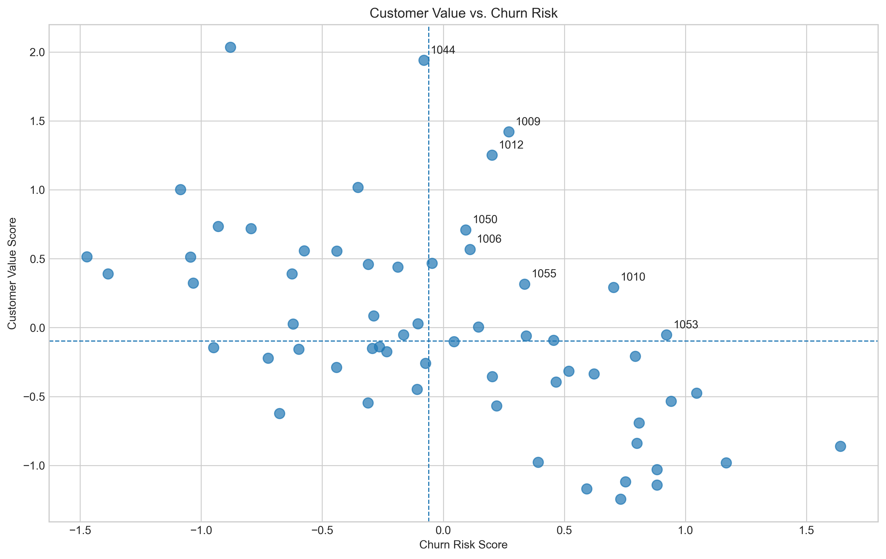

### Interpretation:

The upper-right region represents customers who have generated high historical revenue but have been inactive for a long period.

These customers should be considered the highest-priority retention targets.

---

# 12. Retention Opportunity Analysis

To prioritize retention efforts, a `retention_opportunity` score was used.

This score combines customer value and inactivity/risk information.

The highest retention opportunities include:

| Customer | Total Spending | Days Since Last Purchase | Retention Opportunity |
| -------- | -------------: | -----------------------: | --------------------: |
| 1044     |      14,354.34 |                      165 |                 0.779 |
| 1009     |      11,615.42 |                      232 |                 0.739 |
| 1012     |      11,731.50 |                      224 |                 0.735 |
| 1057     |      13,532.74 |                       82 |                 0.653 |
| 1035     |       5,918.21 |                      365 |                 0.647 |
| 1059     |       8,898.55 |                      224 |                 0.616 |
| 1010     |       7,241.47 |                      276 |                 0.604 |

This ranking is valuable because it changes the question from:

> "Who is likely to churn?"

to:

> "Who should the company save first?"

This is a much more useful business question.

For example, Customer 1035 has been inactive for 365 days and has generated nearly 6,000 historically.

Even if the probability of reactivation is uncertain, the potential financial value makes this customer worth investigating.

---

# 13. Revenue at Risk

Another useful perspective is revenue at risk.

Instead of simply counting the number of at-risk customers, the company should estimate how much historical customer value is associated with these customers.

This allows management to understand the financial importance of customer retention.

A business could have:

> 100 low-value customers at risk

or:

> 10 extremely high-value customers at risk.

The second situation may represent a much larger financial threat.

Therefore, retention strategies should prioritize **economic value**, not simply customer count.

---

# 14. Customer Satisfaction and Return Behavior

Customer satisfaction was also incorporated into the analysis.

The average satisfaction score was approximately:

**2.98 / 5**

This is not particularly high and suggests that customer experience may represent an important area for improvement.

The dataset also contains substantial variation in returned items.

Some customers have returned many items, while others have returned none.

Return behavior is important because a customer may generate high gross revenue while simultaneously creating high operational costs.

Therefore, customer value should ideally be evaluated using:

[
Customer\ Value
\approx
Revenue - Returns - Marketing\ Costs - Service\ Costs
]

The dataset does not provide all of these costs, so historical spending is used as a proxy for customer revenue rather than true profit.

This limitation should be acknowledged when presenting the results.

---

# 15. Geographic Analysis

The third major business question was:

> **Which cities are more suitable for advertising?**

The customer base is distributed across eight cities:

* Tehran
* Mashhad
* Isfahan
* Karaj
* Shiraz
* Tabriz
* Rasht
* Ahvaz

Geographic analysis was performed using customer count, total spending, and average spending.

It is important not to select a city based only on the number of customers.

A city with many customers will naturally tend to have more total revenue.

Therefore, the analysis should consider:

1. Number of customers
2. Total revenue
3. Average customer spending
4. Customer value distribution
5. Risk distribution
6. Satisfaction
7. Return behavior

The goal is not simply to find the city with the highest historical revenue.

The real business question is:

> **Where can additional marketing generate the highest incremental profit?**

---

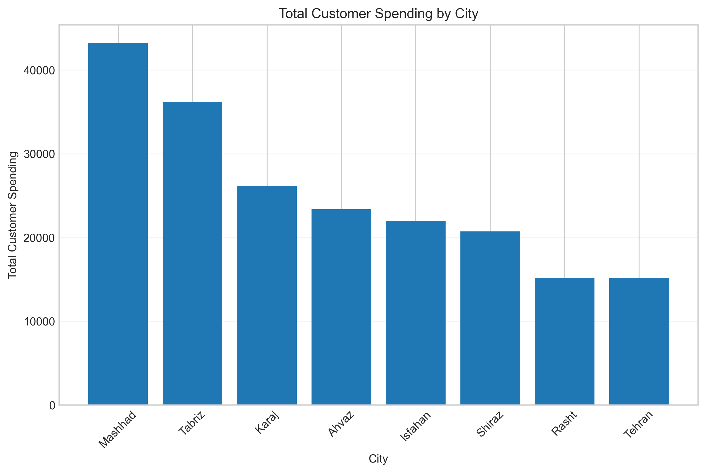

**Total Spending by City**

A bar chart showing total customer spending for each city.

This provides a high-level view of where the company's existing revenue is concentrated.

---

# 16. Geographic Marketing Interpretation

The dataset contains several high-value customers in Mashhad.

Examples include:

* Customer 1012 — 11,731.50
* Customer 1050 — 6,198.00
* Customer 1030 — 4,079.14
* Customer 1006 — 3,868.55

Isfahan also contains high-value customers:

* Customer 1059 — 8,898.55
* Customer 1032 — 4,615.05
* Customer 1005 — 3,899.42

This suggests that Mashhad and Isfahan deserve attention as potential marketing markets.

However, because the dataset contains only 60 customers, these observations should not be treated as definitive evidence that these cities are universally better markets.

Instead, the appropriate business response is to run controlled marketing experiments.

---

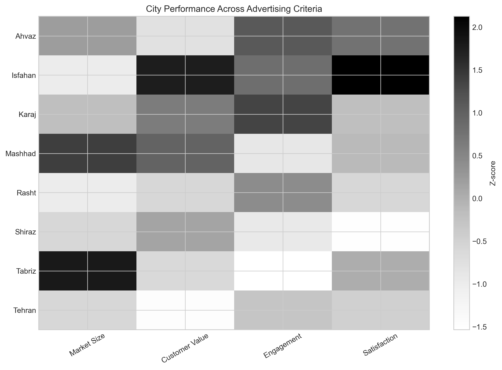

---

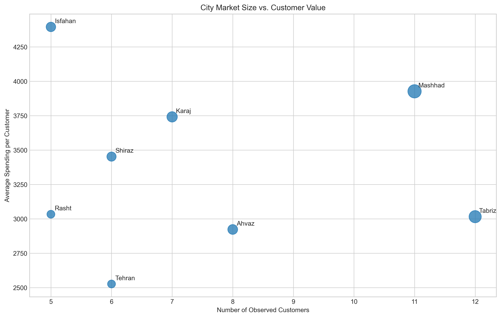

---

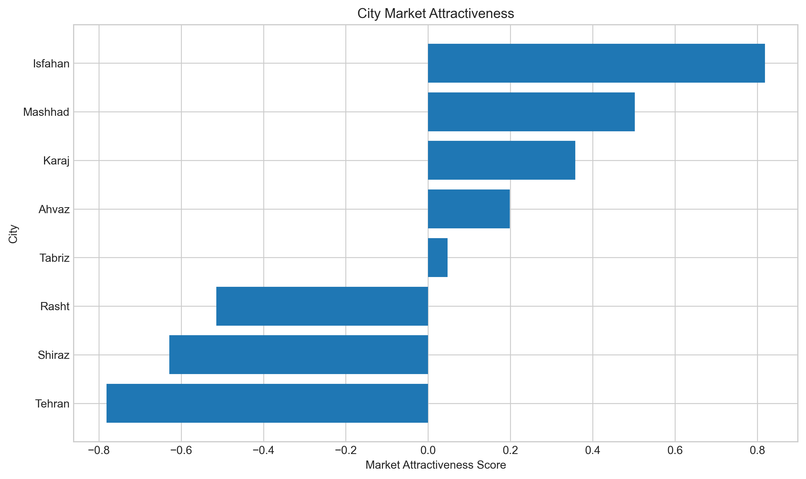

---

# 17. Discount Analysis

The fourth major question was:

> **Were discounts actually useful?**

Customers were divided into:

* Discount users
* Non-discount users

The groups were compared across:

* Total spending
* Average order value
* Purchase frequency
* Satisfaction
* Return behavior

The analysis showed that customers who did not use discounts generated higher average spending.

Average spending was approximately:

**3,736.74**

for non-discount customers compared with:

**2,882.17**

for discount customers.

This represents an observed difference of approximately:

**22.87%**

in favor of the non-discount group.

The median spending showed the same general pattern, suggesting that the difference was not caused only by a small number of extreme customers.

---

# 18. Discount Effect on Average Order Value

Average order value was also slightly higher for customers who did not use discounts:

* Discount users: approximately 203.29
* Non-discount users: approximately 220.70

Therefore, discounts did not demonstrate a clear ability to increase the value of individual orders.

---

# 19. Discount Effect on Purchase Frequency

Purchase frequency was almost identical:

* Discount users: 17.50 purchases
* Non-discount users: 17.29 purchases

The difference is extremely small.

Therefore, the data does not provide strong evidence that discounts substantially increase purchase frequency.

This is important because a discount strategy is only economically attractive if the additional purchases or revenue compensate for the reduction in price.

---

# 20. Discount Effect on Satisfaction

The strongest positive relationship observed for discounts was customer satisfaction.

Average satisfaction was:

* Discount users: approximately 3.27
* Non-discount users: approximately 2.76

This suggests that discounts may have a positive relationship with customer satisfaction.

However, this does not necessarily mean that discounts caused the higher satisfaction.

Customers who received discounts may have been treated differently for other reasons.

---

# 21. Discount Effect on Returns

Return behavior provides another warning.

Although the average number of returned items was slightly lower for discounted customers, their return-to-purchase ratio was higher:

* Discount group: approximately 0.71
* Non-discount group: approximately 0.45

This suggests that discounted customers may return a larger proportion of their purchases.

Therefore, using discounts without considering return behavior could create additional operational costs.

---

# 22. Discount Analysis by Customer Value

The segmentation analysis provides an even more important insight.

Among high-value customers, discounted customers showed lower average spending and lower average order value than non-discounted customers.

Their purchase frequency was slightly higher, but the difference was not large enough to clearly compensate for lower spending.

This suggests that applying discounts universally to high-value customers may simply reduce the amount they pay without significantly changing their behavior.

For low-value customers, the picture was somewhat more positive.

Discounted low-value customers showed:

* Slightly higher spending
* Approximately 14.4% higher average order value
* Higher satisfaction

However, the overall spending difference remained small and the return-to-purchase ratio was higher.

Therefore, discounts may be more appropriate as a targeted engagement mechanism for selected low-value or inactive customers rather than as a universal sales strategy.

---

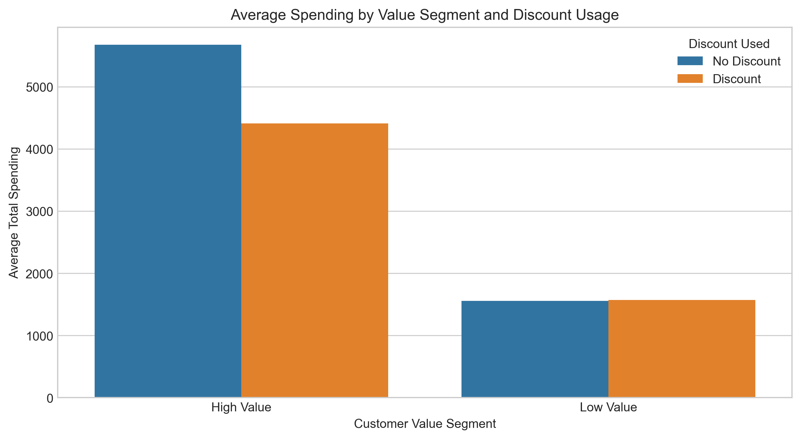

---

# 23. Important Statistical Limitation of the Discount Analysis

The discount analysis is observational.

Customers were not randomly assigned to receive discounts.

Therefore, we cannot conclude:

> "Discounts caused spending to decrease."

The correct interpretation is:

> "Customers who used discounts had lower observed spending in this dataset."

There may be selection effects.

For example, the company may have given discounts specifically to customers who were:

* less active
* less satisfied
* at risk of churn
* strategically targeted

In that case, the lower spending may have existed before the discount.

Therefore:

[
Correlation \neq Causation
]

The appropriate next step is a randomized A/B experiment.

Customers should be randomly divided into:

**Control Group:** no discount

**Treatment Group:** targeted discount

Then compare:

* Conversion rate
* Average order value
* Revenue
* Profit
* Return rate
* Customer satisfaction
* Retention

The final decision should be based on **incremental profit**, not simply revenue.

---
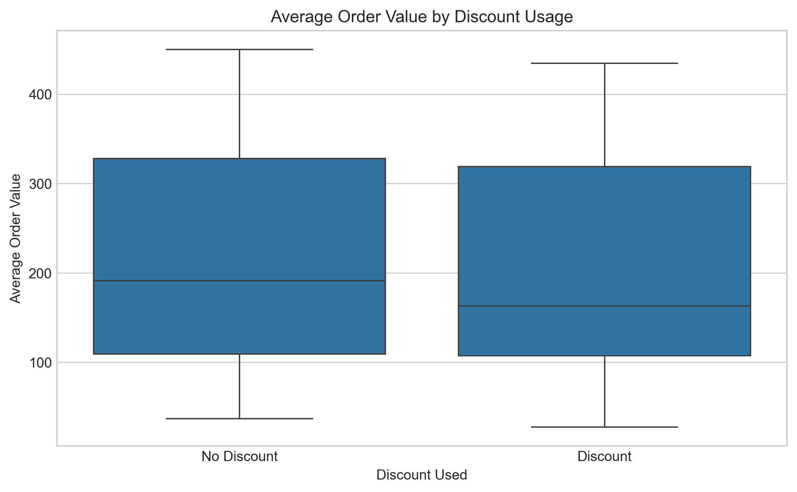
---
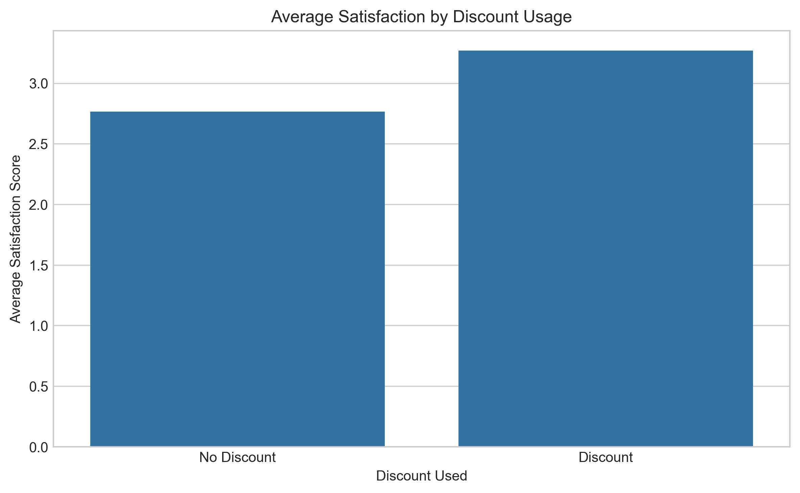
---
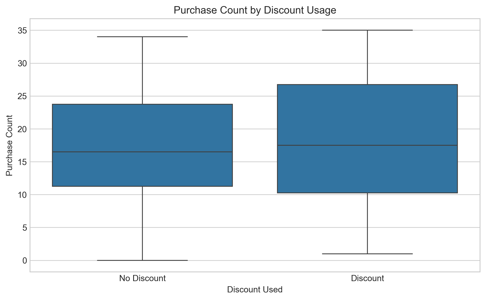
---
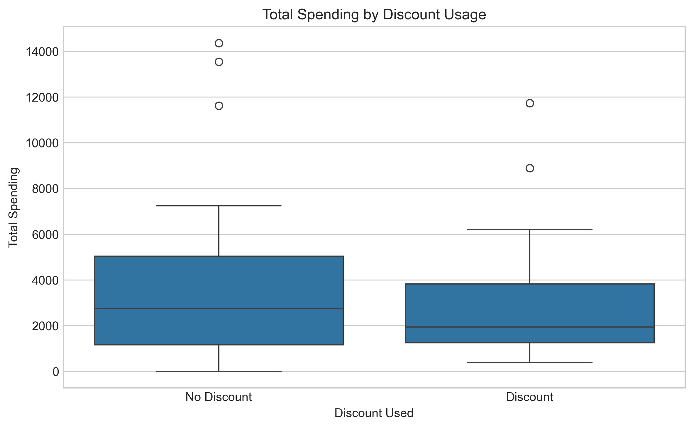
---

# 24. Three Practical Recommendations for Increasing Sales

Based on the complete analysis, three main recommendations are proposed.

---

## Recommendation 1: Launch a High-Value Customer Win-Back Program

The first recommendation is to focus on high-value customers who are currently at risk.

The analysis identified multiple customers with high historical spending and long periods of inactivity.

Examples include:

* Customer 1012 — 11,731.50 spending, 224 days inactive
* Customer 1009 — 11,615.42 spending, 232 days inactive
* Customer 1010 — 7,241.47 spending, 276 days inactive
* Customer 1050 — 6,198.00 spending, 205 days inactive
* Customer 1035 — 5,918.21 spending, 365 days inactive

These customers represent potential lost revenue.

The company should therefore create a targeted win-back campaign.

Instead of sending the same discount to everyone, the company should personalize the intervention.

Possible actions include:

* Personalized product recommendations
* Loyalty rewards
* Free shipping
* VIP benefits
* Early access to products
* Personalized customer support
* Carefully targeted incentives

Direct discounts should not automatically be the first option because the discount analysis did not show a clear overall revenue advantage.

The campaign should prioritize customers using the `retention_opportunity` score.

### Expected business impact

The objective is to recover existing customer value rather than acquire completely new customers.

Even reactivating a small number of high-value customers could generate substantial additional revenue.

### KPIs

The company should measure:

* Reactivation rate
* Repeat purchase rate
* Incremental revenue
* Incremental profit
* Revenue recovered per customer
* Retention rate

---

## Recommendation 2: Increase Average Order Value Through Cross-Selling and Bundling

The second recommendation is to increase revenue from existing customers by increasing the value of each transaction.

The discount analysis showed that discounts did not significantly increase purchase frequency.

Therefore, simply providing more discounts is not the most convincing growth strategy.

Instead, the company should use:

* Cross-selling
* Product recommendations
* Bundles
* Free-shipping thresholds
* Complementary product suggestions

For example:

> "Customers who bought Product A also purchased Product B."

Or:

> "Add 20 more to your cart to receive free shipping."

The goal is to increase the amount spent per transaction without unnecessarily reducing the product price.

If a customer makes 10 purchases with an average order value of 150:

[
10 \times 150 = 1500
]

Increasing the average order value to 180 would generate:

[
10 \times 180 = 1800
]

This creates an additional 300 in revenue without requiring an additional purchase.

### KPIs

The company should monitor:

* Average Order Value
* Items per order
* Cross-sell conversion
* Bundle adoption
* Revenue per customer
* Incremental profit

This strategy should also be tested through A/B testing.

---

## Recommendation 3: Use Targeted Geographic Marketing Experiments

The third recommendation is to allocate marketing budgets based on measured customer value rather than distributing advertising equally across cities.

The dataset shows strong-value customers in several cities, particularly Mashhad and Isfahan.

However, because the sample size is small, the company should not immediately assume that these cities are universally superior.

Instead, the company should conduct controlled city-level experiments.

For example:

### Mashhad

Use a relatively high-priority marketing experiment because several high-value customers are located there.

### Isfahan

Use a smaller pilot campaign to determine whether additional marketing can generate incremental revenue.

### Tabriz

Because valuable customers exist there but some customers also show risk and satisfaction issues, the company should investigate customer experience before aggressively increasing acquisition spending.

The key principle is:

> The best city is not necessarily the city with the most customers or the highest historical revenue.

The best city is the city where additional marketing produces the highest **incremental profit**.

### KPIs

For each city, measure:

* Conversion rate
* Customer acquisition cost
* Revenue per acquired customer
* Incremental revenue
* Incremental profit
* ROAS
* Customer lifetime value

---

# 25. Final Business Strategy

The three recommendations address three different sources of growth.

### Strategy 1 — Recover Lost Value

[
At\ Risk\ Customers
\rightarrow
Reactivation
]

The company protects revenue that is already associated with existing customers.


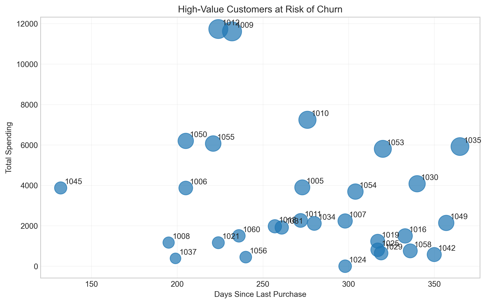

### Strategy 2 — Increase Existing Customer Value

[
Existing\ Customers
\rightarrow
Higher\ AOV
]

The company increases revenue without necessarily requiring additional customers.


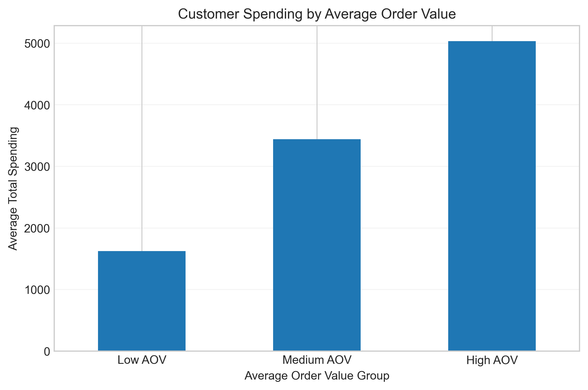

### Strategy 3 — Acquire Profitable New Demand

[
Targeted\ Markets
\rightarrow
New\ Customers
]

The company invests marketing resources where they have the greatest potential return.

Together, these strategies provide a more balanced growth strategy than simply increasing discounts.

---

# 26. Limitations

Several limitations should be considered when interpreting the results.

### Small Sample Size

The dataset contains only 60 customers.

Therefore, the results should be interpreted as insights from this dataset rather than universal conclusions about the company's entire customer population.

### Observational Data

The analysis describes relationships between variables but cannot automatically establish causality.

This is particularly important for discounts.

### Missing Profit Information

The dataset contains spending but does not provide:

* Product costs
* Shipping costs
* Marketing costs
* Discount amounts
* Customer service costs

Therefore, total spending should be interpreted as revenue rather than actual customer profitability.

### No Product-Level Information

Because individual products and categories are not included, detailed product recommendation or product-level basket analysis cannot be performed.

### No Transaction-Level Dates

The dataset contains the number of purchases and days since the last purchase but does not provide the complete transaction history.

A transaction-level dataset would allow much stronger cohort, retention, and lifetime-value analysis.

---

# 27. Future Improvements

If additional data becomes available, the analysis could be significantly improved.

The company should collect:

* Transaction-level purchase history
* Product IDs
* Product categories
* Product prices
* Actual discount amounts
* Cost of goods sold
* Shipping costs
* Marketing costs
* Customer acquisition source
* Campaign exposure
* Website behavior
* Cart abandonment
* Customer lifetime

This would allow the company to calculate:

[
Customer\ Lifetime\ Value
]

[
Customer\ Acquisition\ Cost
]

[
Contribution\ Margin
]

and ultimately:

[
Customer\ Profitability
]

rather than relying primarily on historical revenue.

---

# 28. Final Conclusion

The analysis demonstrates that customer behavior varies considerably across the dataset and that treating all customers in the same way would be inefficient.

The most important finding is that **customer value and customer risk must be considered together**.

Several customers have generated very high historical revenue but have not purchased for a long period. These customers represent the most important retention opportunities.

The discount analysis also suggests that discounts should not be used universally. Discount users did not demonstrate higher overall spending or meaningfully higher purchase frequency, although they showed higher satisfaction. Discounts may therefore be useful as a targeted engagement mechanism rather than a general sales strategy.

Geographic analysis indicates that some cities contain multiple high-value customers, but the small sample size means that city-level conclusions should be validated through controlled marketing experiments.

The three main recommendations are therefore:

### 1. Protect high-value customers

Launch a personalized win-back campaign for high-value customers with high retention opportunity.

### 2. Increase customer basket size

Use cross-selling, product recommendations, bundles, and free-shipping thresholds to increase average order value.

### 3. Invest in high-potential markets

Run controlled geographic marketing experiments and scale advertising only when the incremental return justifies the investment.

The central principle behind all three recommendations is to move from **mass marketing to data-driven targeting**.

Instead of asking:

> "How can we give more discounts?"

the company should ask:

> "Which customer should we target, what action should we take, and what incremental profit can we generate?"

Ultimately, the objective should not simply be to maximize the number of purchases or total revenue.

The objective should be to maximize **sustainable and profitable customer value**.

